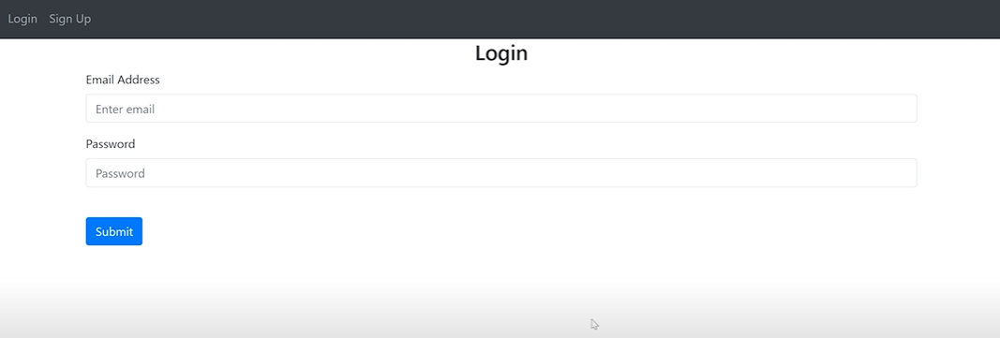
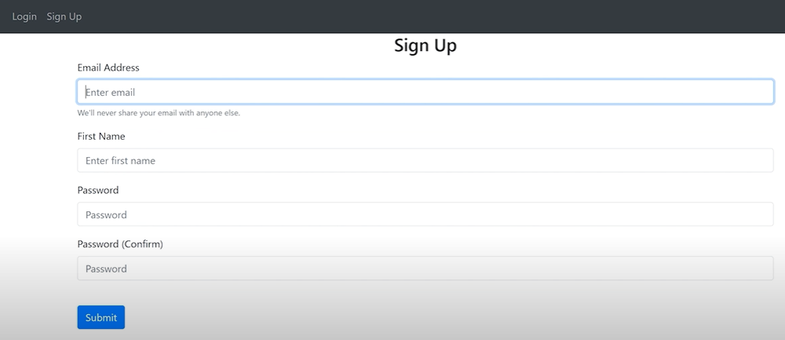

# Website-Development-Flask-Authentication-Databases-More
Developed a web application which provides users with authentication and notes management based on Python, Flask, MySQL, HTML/CSS and Jinja Templating Language

